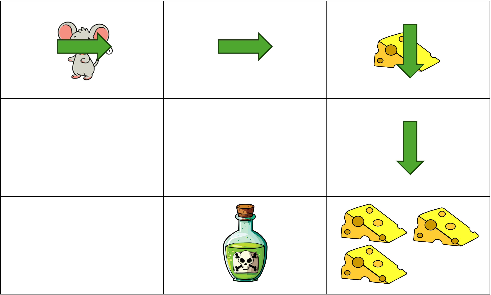

# Exercise6: SARSA vs Q-learning in a 3×3 Maze

## Maze Setup

We have a **3×3 grid world**:

- **Start**: (0,0)
- **Cheese**: (0,2), reward = +1
- **Cheese**: (2,2), reward = +3
- **Poison**: (2,1), reward = –1
- All other moves: reward = –0.1 (step cost)
- Episode ends when the agent gets poison or moves 4 steps.

---

## Parameters

- Discount factor: $\gamma = 1$
- Learning rate: $\alpha = 0.5$
- Policy: ε-greedy (explores sometimes, exploits otherwise)
- Initialize all Q-values to **0**.
- Actions: **Up, Down, Left, Right** (assume blocked moves keep the agent in the same cell).

---

## Task

1. **Draw the Q-table structure**:

   - Rows = states $(i,j)$
   - Columns = actions $\{U, D, L, R\}$
   - Initialize all entries to 0.

2. **Therea are two episodes** 

3. **For each step**, compute the **target** and update the Q-value:

- **SARSA target**:  
  $$
  \text{Target} = R + \gamma Q(s', a')
  $$
  where \(a'\) is the _actual_ action chosen next.
- **Q-learning target**:  
  $$
  \text{Target} = R + \gamma \max\\_{a'} Q(s', a')
  $$

4. **Compare the updates**:

- How does the Q-value of the starting state \((0,0)\) differ under SARSA and Q-learning?
- Which one is learning the **actual behavior** (on-policy)?
- Which one is learning the **optimal greedy policy** (off-policy)?

<!-- --- -->

<!-- ## Questions for Students

- Why does SARSA update more cautiously than Q-learning?
- If the agent often explores and risks hitting the poison at (2,1), which algorithm’s learned policy will reflect that risk more?
- Which algorithm might learn a **shortest path to the goal**, even if it passes close to poison?   -->

---

**Deliverable:** Submit your Q-tables after 2 full episode for **both SARSA and Q-learning**, with step-by-step calculations.
